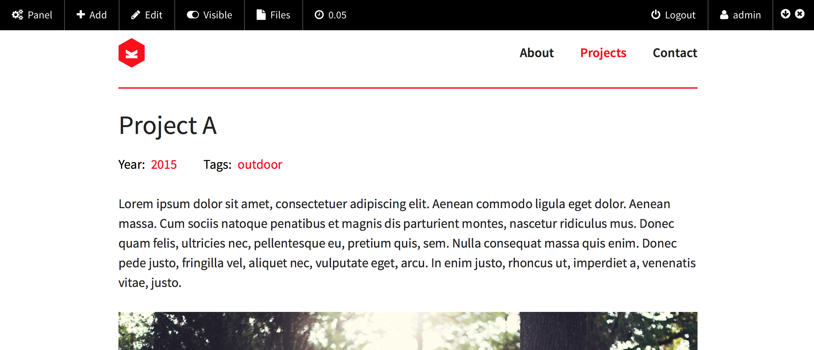

  

[](https://github.com/distantnative/panel-bar/releases)  [](https://github.com/distantnative/panel-bar/issues) [](https://raw.githubusercontent.com/distantnative/panel-bar/master/LICENSE)
[](https://gumroad.com/l/kirby-panelbar)


This plugin enables you to include a panel bar on top of your site which gives you direct access to some administrative functions. The panel bar will only be visible to logged in users who are eligible to access the panel.



**The plugin is free. However, I would really appreciate if you could support me with a [moral license](https://gumroad.com/l/kirby-panelbar)!**


# Table of Contents
1. [Setup](#Setup)
2. [Usage](#Usage)
3. Elements
  1. [Standard Elements](#StandardElements)
  2. [Default Set of Elements](#DefaulSet)
4. Customize
  1. [Custom Set of Elements](#CustomSet)
  2. [Custom Elements](#CustomElements)
  3. [Element Builders](#Builders)
  4. [Custom CSS/JS](#CustomCSSJS)
  5. [Hooks](#Hooks)
  6. [Output CSS/JS](#OutputCSSJS)
5. Options
  1. [Default Position](#OptionPosition)
  2. [Remember State](#OptionState)
  3. [Keyboard Shortcuts](#OptionKeyboard)
5. [Help & Improve](#Help)
6. [Changelog](https://github.com/distantnative/panel-bar/blob/master/CHANGELOG.md)


# Setup<a id="Setup"></a>
1. Download the [panel-bar plugin](https://github.com/distantnative/panel-bar/zipball/master/)
2. Copy the whole folder to `site/plugins/panel-bar`


# Usage <a id="Usage"></a>
Include in your `site/snippets/footer.php` right before the `</body>` tag:
```php
<?php echo panelbar::show() ?>
```

Or with the following if you want the panel bar hidden on load:
```php
<?php echo panelbar::hide() ?>
```

You can toggle the visibility of the panel bar on the right side, if your browser supports Javascript. If not, panel bar will simply hide the toggle switch and display the panel bar always.

**Caching**  
If you want to use caching with Kirby, please make sure to only activate it if the visitor is not a logged-in user (in `site/config/config.php`):
```php
if(!site()->user()) c::set('cache', true);
```


# Elements

### Standard Elements <a id="StandardElements"></a>
The panel bar provides several standard elements:  

Name        | Description
----------- | ---------------------------------------------------------
`panel`     | Open the Kirby panel
`add`       | Add page as sibling or child
`edit`      | Edit current page
`toggle`    | Change the visibility of the current page (hide/publish)
`files`     | Viewer for files of the current page
`images`    | Viewer for images of the current page
`loadtime`  | Info label for loading time
`language`  | Dropdown to switch between site languages
`user`      | Current user
`logout`    | Sign out current user


### Default Set of Elements <a id="DefaultSet"></a>
The pre-defined default set of elements consists of `panel`, `add`, `edit`, `files`, `user` and `logout`. You can define your own [custom set of elements](#CustomSet).


# Customize

### Custom Set of Elements <a id="CustomSet"></a>
To define which elements should be included in the panel bar, you can either set a config option (in `site/config/config.php`):
```php
c::set('panelbar.elements', array(…));
```

Or pass them as an argument when displaying the panel bar:
```php
<?php echo panelbar::show(array('elements' => array(…))) ?>
```

You can include standard elements either by naming them:
```php
c::set('panelbar.elements', array(
  'panel', 
  'edit', 
  'toggle', 
  'languages', 
  'logout', 
  'user'
));
```

Or you can merge your custom array with the default set of elements:
```php
c::set('panelbar.elements', a::merge(array(
  'custom1',
  'custom 2'
), panelbar::defaults()));
```


### Custom Elements <a id="CustomElements"></a>
Panel Bar also is prepared to include custom elements. For custom elements you can either pass the HTML directly in the array or use the name of a callable function in the array which then returns the HTML code.

Examples:
```php
c::set('panelbar.elements', array(
  'panel', 
  'edit',
  'custom-link' => panelbar::link(array(
                    'id'   => 'mum',
                    'icon' => 'heart',
                    'url'  => 'http://mydomain.com/pictureofmum.jpg',
                    'text' => 'Mum'
                  )),
  'custom-dropdown' => 'dropitpanelbar',
  'logout', 
));

function dropitpanelbar() {
  return panelbar::dropdown(array(
    'id'    => 'songs',
    'icon'  => 'headphones',
    'label' => 'Songs',
    'items' => array(
                 0 => array(
                       'url' => 'https://www.youtube.com/watch?v=BIp_Y28qyZc',
                       'text' => 'Como Soy'
                      ),
                 1 => array(
                       'url' => 'https://www.youtube.com/watch?v=gdby5w5rseo',
                       'text' => 'Me Gusta'
                      ),
               )
  ));
}
```


### Element Builders <a id="Builders"></a>
The panel bar plugin includes four builder method, which can be used to create custom elements. All builders require some basic parameters:
```php
panelbar::builder(array(
  'id'     => 'theID',
  'icon'   => 'heart',
  'label'  => 'Just the label',
  'mobile' => 'label',
));
```

The following element builders are available and require additional parameters if referenced:  
<table>
<tr>
  <th>Label</th>
  <th>Link</th>
</tr>
<tr>
  <td style="vertical-align: top;">
<pre lang="php" style="padding: 0;">
panelbar::label(array(
  …,
));</pre>
  </td>
  <td style="vertical-align: top;">
<pre lang="php" style="padding: 0;">
panelbar::link(array(
  …,
  'url' => site()->url().'/panel',
));</pre>
  </td>
</tr>
<tr>
  <th>Dropdown</th>
  <th>Textbox</th>
</tr>
<tr>
  <td style="vertical-align: top;">
<pre lang="php" style="padding: 0;">
panelbar::dropdown(array(
  …,
  'items' => array(
    0 => array(
      'url'   => …,
      'label' => …
    ),
    …
   ),
));</pre>
  </td>
  <td style="vertical-align: top;">
<pre lang="php" style="padding: 0;">
panelbar::box(array(
  …,
  'content' => '<b>Important information</b>',
));</pre>
  </td>
</tr>
</table>


*If you use any builders in the `config.php`, you must prepend the following line:*  
```php
kirby()->plugin('panel-bar');
```


### Custom CSS/JS <a id="CustomCSSJS"></a>
To include your custom CSS and JS with panel bar (e.g. for a [custom element](#CustomElement)), the best way would be to use [asset hooks](#Hooks) in your custom element function. However, you can also pass custom CSS and JS as parameters to the `::show()` and `::hide()` methods:
```php
<?php echo panelbar::show(array('css' => '.mylove{}', 'js' => 'alert("hello")')) ?>
```


### Hooks for Assets/Output <a id="Hooks"></a>
There are two types of hooks in panel bar: asset hooks and output hooks. Asset hooks are divided into `css` and `js`. Output hooks all refer to HTML but are included at different positions in the panel bar: as `element`, `before` and `after`. To make use of assets and output hooks, the plugin passes the `$output` and `$assets` objects to callable custom element functions:
```php
<?php
function customHelpElement($output, $assets) {
  $assets->setHook('css',     '.mylove{}');
  $assets->setHook('js',      'alert("hello")');
  $output->setHook('element', panelbar::label(…));
}

$elements = array(
  'panel',
  'help' => 'customHelpElement',
);

echo panelbar::show(array('elements' => $elements));
?>
```

If you do not want to directly set hooks, you can  return an array instead and the plugin will take care of hooking the CSS, JS and/or HTML into the panel bar:
```php
function customHelpElement($output, $assets) {
  return array(
    'element' => '…',
    'assets'  => array(
      'css' => '.mylove{}',
      'js'  => 'alert("hello")'
    ),
    'html'    => array(
      'before' => '…',
      'after'  => '…'
    )
  );
}
```


### Output CSS/JS separately <a id="OutputCSSJS"></a>
At default, panel bar includes the necessary CSS styles and JS scripts in its output. If you not want to output the CSS and/or JS directly with the panel bar (e.g. separately within the `<head>` section), you first have to disable their output:
```php
<?php echo panelbar::show(array('css' => false, 'js' => false) ?>
```

To output the CSS and/or JS wherever you want it, just use `::css()` or `::js()`:
```php
<?php echo panelbar::js() ?>
```

You can still pass your [custom CSS/JS](#CustomCSSJS) to these methods:  
```php
<?php echo panelbar::css('.mylove{}') ?>
```


# Options
All options refer to settings in the `site/config/config.php` if not stated otherwise.

### Default Position <a id="OptionPosition"></a>
To change the default position of the panel bar to bottom include:
```php
c::set('panelbar.position', 'bottom');
```


### Remember State <a id="OptionState"></a>
The panel bar will be loaded on default at the [defined positon](#OptionPosition) and visible whether you included it in your templates with `::show()` or `::hide()`. If you want the panel bar to remember its state across page loads (e.g. it loads on top, you move it to bottom and you want it to be still on bottom after clicking on a link), you need to include:
```php
c::set('panelbar.remember', true);
```


### Keyboard Shortcuts <a id="OptionKeyboard"></a>
By default the panel bar features a few keyboard shortcuts:  

Keyboard Shortcut    | Effect
-------------------- | -------------
`alt` + `X`          | Toggle visibility (show/hide)
`alt` + `-` (dash)   | Toggle position (top/bottom)
`alt`+ `up arrow`    | Set position to top
`alt` + `down arrow` | Set position to bottom
`alt` + `E`          | Toggle Edit mode
`alt` + `R`          | Close Panel iFrame and Refresh
`alt` + `P`          | Go to the Kirby panel

If you want to deactivate these keyboard shortcuts, you have to include:
```php
c::set('panelbar.keys', false);
```


# Help & Improve <a id="Help"></a>
If you find any bugs, have troubles or ideas for new elements or further configuration options, please let me know [by opening a new issue](https://github.com/distantnative/panel-bar/issues/new).

So far the plugin has been free of charge and open for everyone to use it. Still, if it helps you with your work and/or life and you can share, I would really appreciate your support by buying a [moral license](https://gumroad.com/l/kirby-panelbar).
