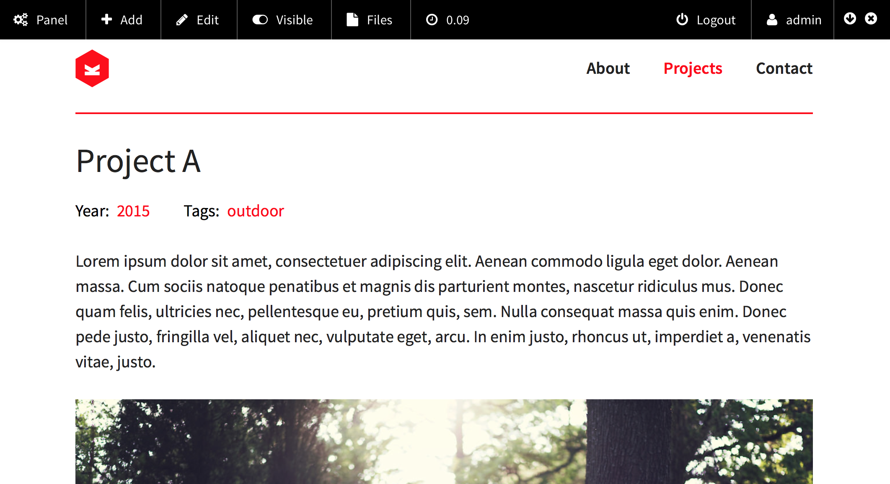
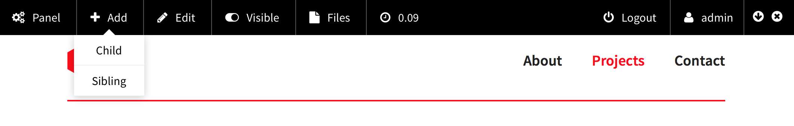
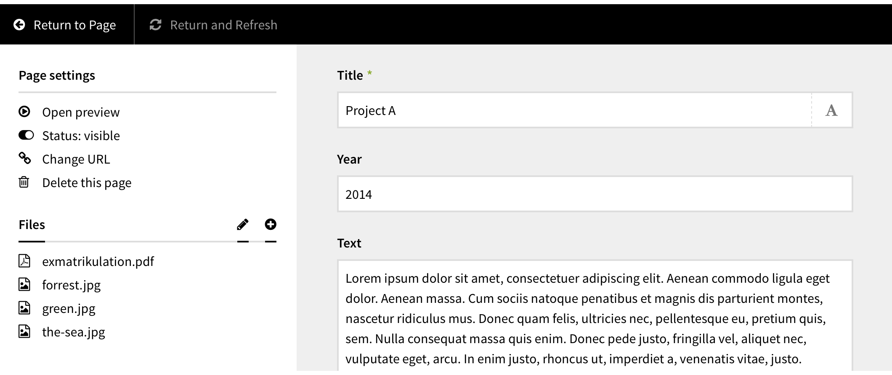
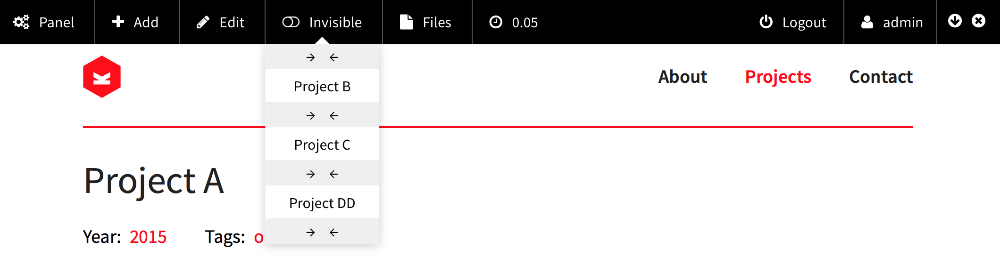
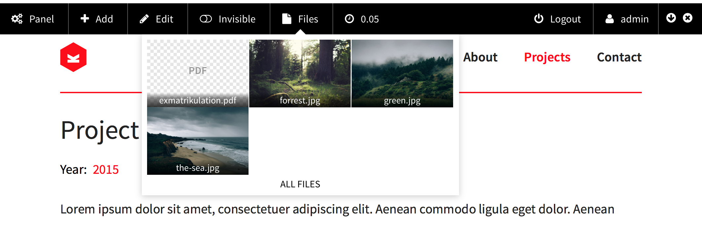

  

[](https://github.com/distantnative/panel-bar/releases)  [](https://github.com/distantnative/panel-bar/issues) 
[](https://gumroad.com/l/kirby-panelbar)


This plugin enables you to include a panelBar on top of your site which gives you direct access to [some administrative functions](#StandardElements). The panelBar will only be visible to logged in users who are eligible to access the panel.

*Requires PHP 5.3+ and Kirby 2.3 or higher*


  
  
  

  


**Please support the development by buying a [moral license](https://gumroad.com/l/kirby-panelbar)!**

&nbsp;  

# Table of Contents
1. [Setup](#Setup)
2. [Usage](#Usage)
3. Elements
  1. [Standard Elements](#StandardElements)
  2. [Default Set of Elements](#DefaulSet)
4. Customize
  1. [Custom Set of Elements](#CustomSet)
  2. [Custom Elements](#CustomElements)
  3. [Element Patterns](#Patterns)
  4. [Custom Element Plugins](#Plugins)
    1. [Custom CSS/JS](#CustomCSSJS)
    2. [Hooks](#Hooks)
  5. [Output CSS/JS](#OutputCSSJS)
  6. [Assets Guide](GUIDE.md)
5. Options
  1. [Default Position](#OptionPosition)
  2. [Responsiveness](#OptionResponsive)
  3. [Remember State](#OptionState)
  4. [Keyboard Shortcuts](#OptionKeyboard)
6. [Known Problems](#Problems)
7. [Help & Improve](#Help)
8. [Changelog](CHANGELOG.md)

&nbsp;  

# Setup<a id="Setup"></a>
1. Download the [panelBar plugin](https://github.com/distantnative/panel-bar/zipball/master/)
2. Copy the whole folder to `site/plugins/panel-bar`

&nbsp;  

# Usage <a id="Usage"></a>
Include in your `site/snippets/footer.php` (or equivalent) before the `</body>` tag:
```php
<?php snippet('plugin.panelBar') ?>
```

If you want the panelBar hidden when the page loads:
```php
<?php snippet('plugin.panelBar.hide') ?>
```

If you want to use **caching with Kirby**, please make sure to only activate it if the visitor is not a logged-in user:
```php
if(!site()->user()) c::set('cache', true);
```

&nbsp;  

# Elements

### Standard Elements <a id="StandardElements"></a>
The panelBar provides several standard elements:  

Name        | Description
----------- | ---------------------------------------------------------
`panel`     | Open the Kirby panel
`index`     | List of all pages (index)
`add`       | Add page as sibling or child
`edit`      | Edit current page
`toggle`    | Change the visibility of the current page (hide/publish)
`files`     | List of files of the current page
`images`    | Viewer for images of the current page
`loadtime`  | Info label for loading time
`language`  | Dropdown to switch between site languages
`system`    | Info box with version check of kirby, toolkit and the panel
`user`      | Current user
`logout`    | Sign out current user


### Default Set of Elements <a id="DefaultSet"></a>
The pre-defined default set of elements consists of `panel`, `add`, `edit`, `toggle`, `files`, `user` and `logout`. You can define your own [custom set of elements](#CustomSet).

&nbsp;  

# Customize

### Custom Set of Elements <a id="CustomSet"></a>
You can define a custom set of elements in `site/config/config.php`:
```php
c::set('panelbar.elements', […]);
```

Or pass them as a parameter when including the snippet:
```php
<?php snippet('plugin.panelBar', ['elements' => […]]) ?>
```

To include [standard elements](#StandardElements) in your custom set, simply name them:
```php
c::set('panelbar.elements', [
  'panel',
  'edit',
  'languages',
]);
```


### Custom Elements <a id="CustomElements"></a>
The panelBar can include custom elements. You can either include the custom element's output code directly in the elements array or use the name of a callable function in the array, which returns the output code:
```php
<?php
// custom callable element
function customSongs() {
  return '<div class="panelbar-element panelbar-drop"><span><i class="fa fa-headphones "></i><span>Songs</span></span><div class="panelbar-drop__list"><a href="https://www.youtube.com/watch?v=BIp_Y28qyZc" class="panelbar-drop__item">Como Soy</a><a href="https://www.youtube.com/watch?v=gdby5w5rseo" class="panelbar-drop__item">Me Gusta</a></div></div>';
}

// array of elements
$elements = [
  'panel',
  'add',
  'edit',
  '<div class="panelbar-element panelbar-btn"><a href="http://mydomain.com/pictureofmum.jpg"><i class="fa fa-heart "></i><span>Mum</span></a></div>',
  'customSongs',
];

// output panelBar
snippet('plugin.panelBar', ['elements' => $elements])
?>
```

For more complex custom elements, have a look at panelBar's [assets guide](GUIDE.md) on its core CSS and Javascript elements.

### Element Patterns <a id="Patterns"></a>
…

### Custom Element Plugins <a id="Plugins"></a>
…

#### Custom CSS/JS <a id="CustomCSSJS"></a>
…


#### Hooks for Assets/Output <a id="Hooks"></a>
…


### Output CSS/JS separately <a id="OutputCSSJS"></a>
…

&nbsp;  

# Options
All options refer to settings in the `site/config/config.php` if not stated otherwise.

### Default Position <a id="OptionPosition"></a>
To change the default position of the panelBar to bottom include:
```php
c::set('panelbar.position', 'bottom');
```


### Responsivesness <a id="OptionResponsive"></a>
To deactivate the javascript that makes the panelBar responsive to mobile devices include:
```php
c::set('panelbar.responsive', false);
```


### Remember State <a id="OptionState"></a>
The panelBar will be loaded on default at the [defined positon](#OptionPosition) and visible whether you included it in your templates with `::show()` or `::hide()`. But it also tries to remember its state across page loads (e.g. it loads on top, you move it to bottom and you want it to be still on bottom after clicking on a link) via your browser's local storage. If you want to disable this, you need to include:
```php
c::set('panelbar.remember', false);
```


### Keyboard Shortcuts <a id="OptionKeyboard"></a>
By default the panelBar features a few keyboard shortcuts:  

Keyboard Shortcut    | Effect
-------------------- | -------------
`alt` + `X`          | Toggle visibility (show/hide)
`alt` + `-` (dash)   | Toggle position (top/bottom)
`alt`+ `up arrow`    | Set position to top
`alt` + `down arrow` | Set position to bottom
`alt` + `M`          | Open Edit mode
`alt` + `P`          | Open the Kirby panel

If you want to deactivate these keyboard shortcuts, you have to include:
```php
c::set('panelbar.keys', false);
```

&nbsp;  

# Known Problems <a id="Problems"></a>
**X-Frame-Options**  
If you have set the `X-Frame-Options` in your `.htaccess` to `DENY`, panelBar will not be able to display the panel in its embedded iFrame mode. panelBar tries to detect this barrier and then switch to plain links.

&nbsp;  

# Help & Improve <a id="Help"></a>
If you find any bugs, have troubles or ideas for new elements or further configuration options, please let me know [by opening a new issue](https://github.com/distantnative/panel-bar/issues/new).

So far the plugin has been free of charge and open for everyone to use it. Still, if it helps you with your work and/or life and you can share, I would really appreciate your support by buying a [moral license](https://gumroad.com/l/kirby-panelbar).
